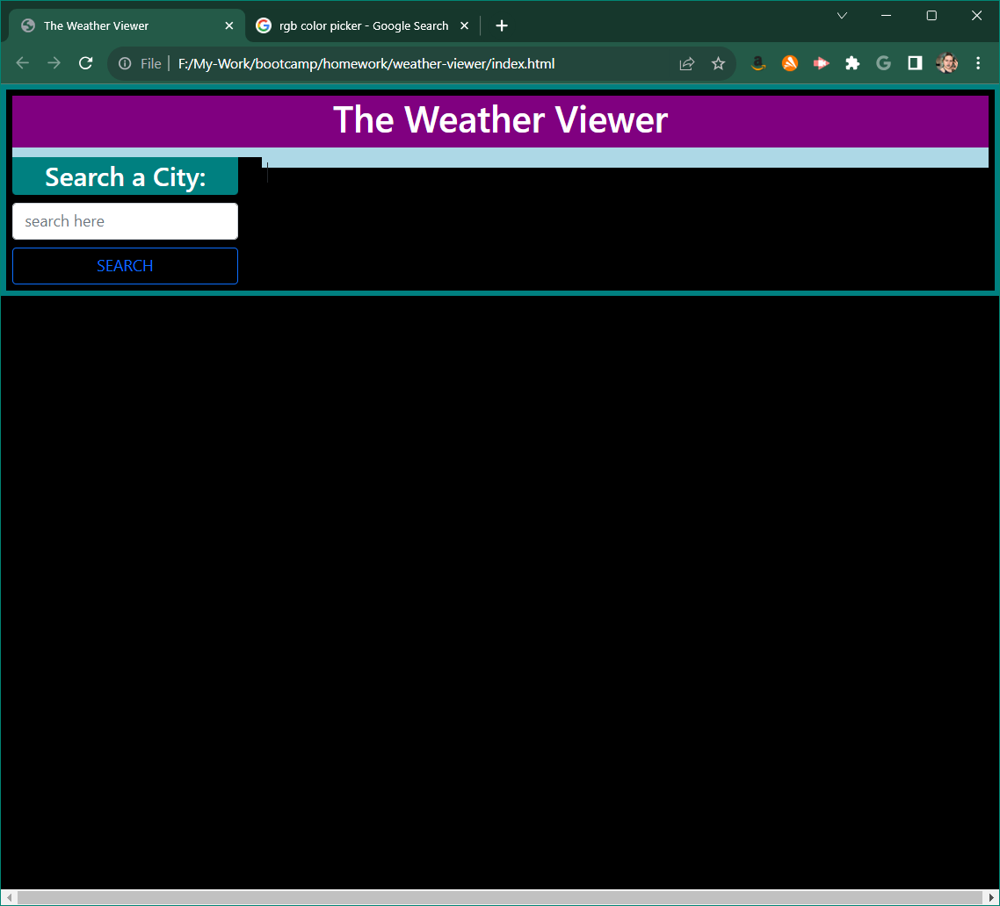
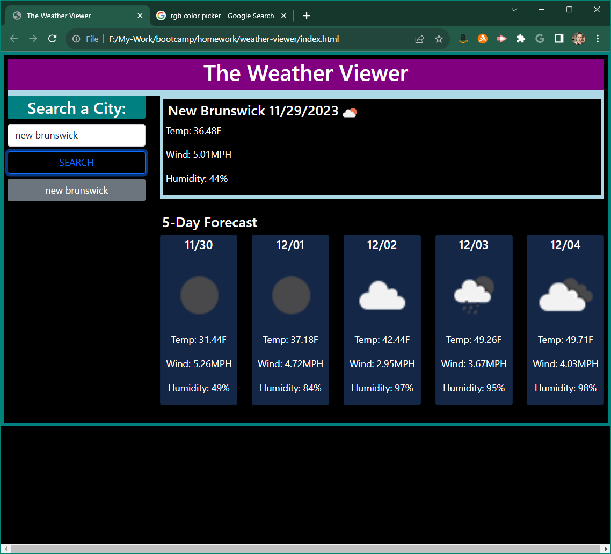
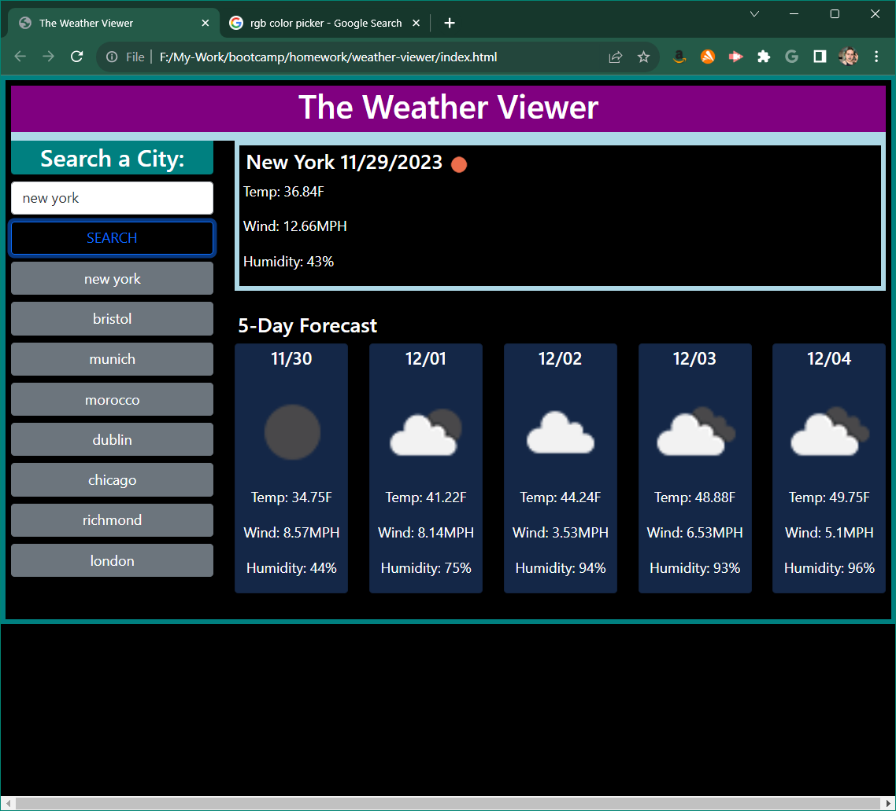

# The Weather Viewer

# Description

An interactive weather viewing app allowing the user to see the current weather along with a 5 day forecast of any city by typing its name into the search bar.

# Usage

To plan an outing based on the weather forecast of a specific city.

[link-to-site](https://e6m9.github.io/weather-viewer)